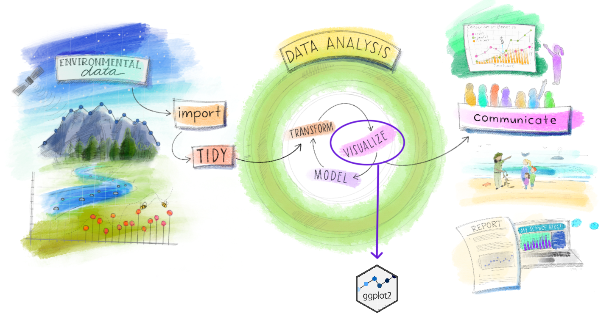
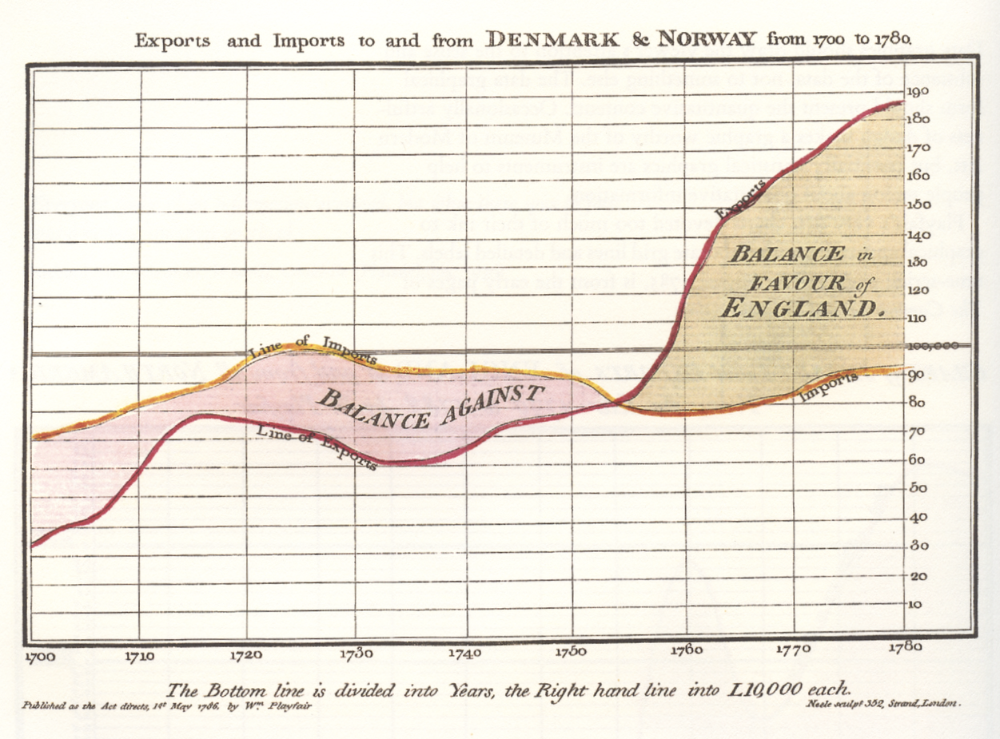
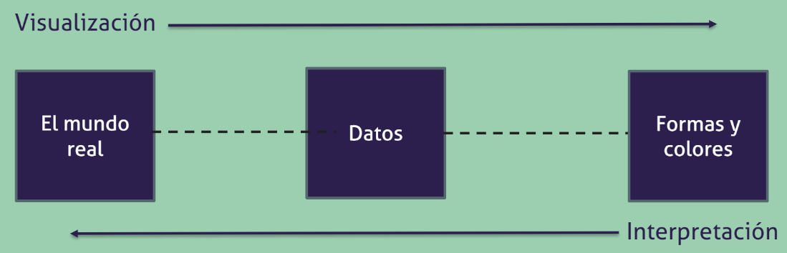
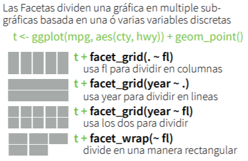

class: middle
```{r setup, include=FALSE}
knitr::opts_chunk$set(echo = TRUE, message=FALSE, warning=FALSE, fig.retina = 3)
library(icon)
```
```{css, echo= FALSE}
.silver{color: silver;}
.gray{color: darkgray;}
```

<!-- <div class="my-footer"><span>text</span></div>
-->

.pull-left[
# Taller Introductorio a `ggplot2`
## RLadies Chile
### .gray[Aprendamos sobre visualización y el uso del paquete ggplot2]
### .gray[Gabriela Sandoval]
[`r fa(name = "twitter")`@gabysandovalm](http://twitter.com/gabysandovalm)  
[`r fa(name = "github")` @gabysandovalm](http://github.com/gabysandovalm)

]

.pull-right[
.center[
<br>
<br>
<br>

]]

---
class: middle
# Sobre el taller

<small>Ilustración por: Allison Horst, adaptación de: [R4DS](https://r4ds.had.co.nz/explore-intro.html)</small>

---
class: middle
# ¿Qué es necesario para este taller?

- Conocer sobre R y RStudio.
- Tener una cuenta en **RStudio Cloud** (si desean acceder al ejercicio para volver a hacerlo).
- Tener ganas de aprender sobre visualización.

## Objetivo: 
>Hablar sobre visualización de datos y la lógica de funcionamiento de `ggplot2` y por supuesto construir algunos gráficos. `r icon::fa(name="rocket")`

---
class: middle, inverse
# Visualización de datos

---
# ¿Por qué hacemos visualizaciones de datos?
--

Visualizamos para:

--

- Expresar

```{r echo= FALSE, out.width="70%",fig.align='center',fig.cap="Pintura rupestre"}

```

---
# ¿Por qué hacemos visualizaciones de datos?


Visualizamos para:


- Comunicar
```{r echo= FALSE, out.width="70%",fig.align='center',fig.cap="William Playfair (1786) El Atlas Comercial y Político: Representando el progreso del comercio, ingresos, gastos y deudas de Inglaterra durante todo el siglo XVIII."}

```

---
# ¿Por qué hacemos visualizaciones de datos?


Visualizamos para:


- Transmitir el significado de los datos 

```{r echo= FALSE, out.width="70%",fig.align='center',fig.cap="Diagrama de la rosa de Florence Nightingale, sirvió para determinar que la principal causa de muerte de los soldados durante la guerra de Crimea, era falta de higiene en los hospitales."}

knitr::include_graphics("images/rosaflorence.jpg")
```

---
class: inverse center

## Al realizar visualizaciones de datos tenemos un gran poder en nuestras manos.

--
```{r echo= FALSE, out.width="70%",fig.align='center'}
knitr::include_graphics("images/pinera1.jpg")
```

---
class: inverse center

## Al realizar visualizaciones de datos tenemos un gran poder en nuestras manos.

```{r echo= FALSE, out.width="70%",fig.align='center'}

```

---
background-image: url(images/patri.png)
background-size: 50%
background-position: 90% 50%

# Características de una buena visualizacion de datos

.pull-left[
+ Que sea agradable a la vista

+ Que sea funcional 

+ Que muestre hallazgos

+ Que esté basada en datos confiables, es decir, que transmita la verdad.
]

.pull.right[
<br><br><br><br><br><br><br><br><br><br><br><br><br>
]

<small>**Nota:** Esta visualización fue realizada por Patricia Loto y en este [LINK](https://github.com/PatriLoto/viz-datos-con-ggplot2-para-WIDS2020/blob/master/material/PRESENTACION_WIDS2020.pdf) pueden encontrar una presentación muy completa sobre aspectos relacionados a visualización de datos.</small>

---
# Elementos de una visualización

--

### .gray[1) Señales visuales]

--

### .gray[2) Sistema de coordenadas]

--

### .gray[3) Escalas]

--

### .gray[4) Contexto]

--

```{r echo= FALSE, out.width="70%",fig.align='center'}

```


<small>
Diagrama por Patricia Loto en base a [Data points visualizations that means something.](https://www.amazon.es/Data-Points-Visualization-Means-Something/dp/111846219X)</smal>

---
background-image: url(images/visualizacion.jpg)
background-size: cover
class: center,top
#**¿Qué herramientas usar para generar visualizaciones de datos?**

---
background-image: url(images/ggplot.png)
background-size: 35%
background-position: 50%,50%
class: inverse

---
background-image: url(images/ggplot.png), url(images/tidy.png)
background-size: 10%, 10%
background-position: 80% 10%, 93% 10%
class: middle

.center[# Paquete `ggplot2`]

- Es un paquete de `R` para crear gráficos de forma **declarativa**.

- Proporcionamos los datos y luego le decimos cómo mapear las variables (estéticas/**aesthetics**), qué tipo de gráfica (geometría/**geom**) usar y detalles adicionales.

- Fue desarrollado por [Hadley Wickham](https://github.com/hadley) (2008) y está basado en [The Grammar of Graphics.](https://www.amazon.com/Grammar-Graphics-Statistics-Computing/dp/0387245448/ref=as_li_ss_tl?ie=UTF8&qid=1477928463&sr=8-1&keywords=the+grammar+of+graphics&linkCode=sl1&tag=ggplot2-20&linkId=f0130e557161b83fbe97ba0e9175c431)

- Es parte de la colección de paquetes para Ciencia de Datos [Tidyverse](https://www.tidyverse.org/).


```{r eval=FALSE}
#Para instalar (todo tidyverse incluido ggplot2)
install.packages("tidyverse")

#Para instalar solo ggplot2
install.packages("ggplot2")
```

---
# Gramática de los gráficos y capas

Un objeto ggplot requiere:
- Datos
- Estéticas de mapeo (**aesthetics**) de las variables y sus propiedades visuales.
- Al menos una **capa** que indique la forma en que se representarán los datos (**geom**).

### Datos

Vamos a usar el set de datos `millas` del paquete `datos` que contiene observaciones para 38 modelos de automóviles recopiladas por la Agencia de Protección Ambiental de los EE. UU.

```{r eval= FALSE}
#install.packages("remotes")
remotes::install_github("cienciadedatos/datos")
library(datos)
```
---
class: middle
```{r}
library(datos)
str(millas)
```

---

### Tenemos los datos... empecemos a sentirnos artistas.

```{r echo=FALSE,fig.align='center',out.width="60%",fig.cap="Ilustración por Allison Horst"}
knitr::include_graphics("images/art.png")
```

```{r include=FALSE}
library(tidyverse)
```

Iniciamos el gráfico con la función: `ggplot()`.

```{r eval=FALSE}
ggplot(data=millas)
```

---
### Capas
.pull-left[
<br>
<br>
Cada capa se agrega con un signo +. Por ejemplo, `geom_point()` agrega una capa de puntos al gráfico. En cada geom podemos incluir el argumento `mapping` (que se empareja con `aes()`) en donde indicamos las variables que vamos a "mapear".
]

.pull-right[
```{r echo=FALSE, fig.height=6}
ggplot(data = millas) +
  geom_point(mapping = aes(x = cilindrada, y = autopista))
```
]
```{r eval=FALSE} 
*ggplot(data = <DATOS>) +
*  <GEOM_FUNCIÓN>(mapping = aes(<MAPEOS>))
```

```{r echo=TRUE, eval=FALSE}
ggplot(data = millas) +
  geom_point(mapping = aes(x = cilindrada, y = autopista))
```


---
class:middle
### ¿Cómo cambiar/incluir más estéticas en mi gráfica?

.pull-left[

#### Cambiar el color de los puntos:
Cambiamos la estética, pero **no** añadimos información adicional. El argumento `color` va dentro de la función `geom_point()`.
]

.pull-right[
```{r echo=FALSE}
ggplot(data = millas) +
  geom_point(mapping = aes(x = cilindrada, y = autopista),color="blue")
```
]

```{r echo=TRUE, eval=FALSE}
ggplot(data = millas) +
*  geom_point(mapping = aes(x = cilindrada, y = autopista),color="blue")

```

---
class: middle

.pull-left[
#### Diferenciar los puntos según la variable `clase`:
Cambiamos la estética y añadimos información adicional. El argumento `color` va dentro de la función `aes()`.
]

.pull-right[
```{r echo=FALSE}
ggplot(data = millas) +
  geom_point(mapping = aes(x = cilindrada, y = autopista,color=clase))
```
]

```{r echo=TRUE, eval=FALSE}
ggplot(data = millas) +
*  geom_point(mapping = aes(x = cilindrada, y = autopista,color=clase))
```


---
### ¿Qué pasa si colocamos el argumento `mapping`  en `ggplot()`?

```{r eval=FALSE}
ggplot(data = millas,mapping = aes(x = traccion, y = autopista)) +
  geom_point()
```

--

.pull-left[
Colocar `mapping` como argumento en una función `geom_()` hace que esas estéticas se reconozcan como locales. Colocar `mapping` en `ggplot()` conserva esa información en todas las capas.  Con eso podríamos ahorrarnos algo de código. 
]

.pull-right[
```{r echo=FALSE}
ggplot(data = millas,mapping = aes(x = cilindrada, y = autopista)) +
  geom_point()
```
]


---

###.gray[Veamos un ejemplo:]

```{r eval=FALSE}
*ggplot(data = millas,mapping = aes(x = cilindrada, y = autopista)) +
  geom_point() +
  geom_smooth()
```

.pull-left[
<br><br><br>
Con esto se conservan las mismas variables de mapeo en todas capas que agregamos. No debemos volver a escribir `mapping = aes(x = cilindrada, y = autopista)` en cada función `geom_()`.
]

.pull-right[
```{r echo=FALSE}
ggplot(data = millas,mapping = aes(x = cilindrada, y = autopista)) +
  geom_point() +
  geom_smooth()
```
]

---
## Facetas

Para dividir un gráfico en sub gráficos (facetas) tenemos las funciones `facet_grid()` y `facet_wrap()`.


Usemos la variable `traccion` para crear sub gráficos para cada tipo de tracción.

Pero primero podemos guardar en un objeto llamado `p` la función `ggplot()` con las estéticas declaradas para luego ir sumando capas:

```{r}
p <- ggplot(data = millas,mapping = aes(x = cilindrada, y = autopista))
```

---

.pull-left[
```{r eval=FALSE}
p + 
   geom_point() +
   geom_smooth() +
*  facet_grid(.~ traccion)
```
]

.pull-right[
```{r echo=FALSE}
(p + 
  geom_point() +
  geom_smooth() +
  facet_grid(.~traccion))
```
]

Este esquema nos explica bien las diferentes formas de usar `facet_grid()` y `facet_wrap()`: 

```{r echo=FALSE,fig.align='center',out.width="35%"}

```

---
## Temas

También podemos usar temas predeterminados para agregar personalizaciones a nuestros gráficos.

.pull-left[
```{r eval=FALSE}
p + 
   geom_point() +
   geom_smooth() +
   facet_grid(.~ traccion) + 
*   theme_bw()
```
]

.pull-right[
```{r echo=FALSE}
p + 
   geom_point() +
   geom_smooth() +
   facet_grid(.~ traccion) + 
   theme_bw()
```
]

---
## Transformaciones estadísticas

Ahora usemos un `geom_bar()` para visualizar el número total de autos según las categorías de la variable `clase`.

Por defecto, con `geom_bar()` ggplot nos muestra el total de cada categoría.

```{r eval=FALSE}
ggplot(data = millas) +
*  geom_bar(mapping=aes(x=clase))
```

```{r echo=FALSE, out.width="40%",fig.align='center'}
ggplot(data = millas) +
  geom_bar(mapping=aes(x=clase))
```

---

### .gray[¿Cómo hacemos si en lugar del total de cada categoría quiero la proporción?]

Usamos una trasformación estadística para el eje y:
```{r eval=FALSE}
ggplot(data = millas) +
*  geom_bar(mapping = aes(x = clase, y = stat(prop)))
```


```{r echo=FALSE, out.width="40%",fig.align='center'}
ggplot(data = millas) +
  geom_bar(mapping = aes(x = clase, y = stat(prop)))
```

¡Pero todas las barras tienen la misma altura!

---

En este caso es necesario especificar un argumento adicional en la función `aes()`. Con `group=1` hacemos que la proporción se calcule respecto a todos los datos y no respecto a cada categoría.

```{r eval=FALSE}
ggplot(data = millas) +
*  geom_bar(mapping = aes(x = clase, y = stat(prop),group=1))
```


```{r echo=FALSE, out.width="40%",fig.align='center'}
ggplot(data = millas) +
  geom_bar(mapping = aes(x = clase, y = stat(prop),group=1))
```

---
### .gray[¿Qué tal si quiero cambiar el orden de mis categorías?]

Para ordenar una forma sencilla es usar la función `fct_infreq()` del paquete `forcats` en la variable clase:

```{r eval=FALSE}
ggplot(data = millas) +
*  geom_bar(mapping=aes(x=forcats::fct_infreq(clase)))
```

```{r echo=FALSE, out.width="40%",fig.align='center'}
ggplot(data = millas) +
  geom_bar(mapping=aes(x=forcats::fct_infreq(clase)))
```

---
Pongamos un poco de color también, esta vez con el argumento `fill`:

```{r eval=FALSE}
ggplot(data = millas) +
*  geom_bar(mapping=aes(x=forcats::fct_infreq(clase)),fill="blue")
```

```{r echo=FALSE, out.width="40%",fig.align='center'}
ggplot(data = millas) +
  geom_bar(mapping=aes(x=forcats::fct_infreq(clase)),fill="blue")
```
¡Pero el nombre del eje x cambió!
---

Cambiemos también el nombre del eje x con `xlab()`:


```{r eval=FALSE}
ggplot(data = millas) +
  geom_bar(mapping=aes(x=forcats::fct_infreq(clase)),fill="blue")+
* xlab("Clase")      
```

```{r echo=FALSE, out.width="40%",fig.align='center'}
ggplot(data = millas) +
  geom_bar(mapping=aes(x=forcats::fct_infreq(clase)),fill="blue") + 
  xlab("Clase")
```

---
###.gray[¿Y si quiero que cada barra tenga un color distinto?]

Podemos usar la variable `clase` en el argumento `fill` pero esta vez dentro de la función `aes()`.

```{r eval=FALSE}
ggplot(data = millas) +
*  geom_bar(mapping=aes(x=forcats::fct_infreq(clase),fill=clase))+
   xlab("Clase")      
```

```{r echo=FALSE, out.width="40%",fig.align='center'}
ggplot(data = millas) +
   geom_bar(mapping=aes(x=forcats::fct_infreq(clase),fill=clase))+
   xlab("Clase")      
```

Pero este gráfico es redundante porque la información de la leyenda es la misma que tenemos en el eje x.

---

Para quitar la leyenda usamos el argumento `show.legend = FALSE` dentro de la función `geom_()`

```{r eval=FALSE}
ggplot(data = millas) +
*  geom_bar(mapping=aes(x=forcats::fct_infreq(clase),fill=clase),show.legend = FALSE)+
  xlab("Clase")      
```

```{r echo = FALSE,out.width="50%",fig.align='center'}
ggplot(data = millas) +
  geom_bar(mapping=aes(x=forcats::fct_infreq(clase),fill=clase),show.legend = FALSE)+
  xlab("Clase")      
```


---
### .gray[¿Visualizar un resumen estadístico?]

También podemos visualizar un resumen estadístico. Por ejemplo visualicemos el mínimo, máximo y mediana de la variable `autopista` para cada categoría de `clase` usando `stat_summary()`:

```{r eval=FALSE}
ggplot(data = millas) +
*  stat_summary(
    mapping = aes(x = clase, y = autopista),
    fun.min = min,
    fun.max = max,
    fun = median
  )
```

```{r echo=FALSE, out.width="30%",fig.align='center'}
ggplot(data = millas) +
  stat_summary(
    mapping = aes(x = clase, y = autopista),
    fun.min = min,
    fun.max = max,
    fun = median
  )
```

---
class: inverse, center, middle

## Y con eso tienes una base para introducirte al increíble mundo de la visualización de datos `r icon::fa(name="rocket")`

---
class: middle, inverse

## Recursos recomendados:

+ [Cheatsheet de ggplot2 en español](https://rstudio.com/wp-content/uploads/2016/12/ggplot2-cheatsheet-2.1-Spanish.pdf)

+ [Libro de ggplot](https://www.amazon.es/ggplot2-Elegant-Graphics-Data-Analysis/dp/0387981403)

+ Capítulo 3 y 28 de R para [Ciencia de Datos](https://es.r4ds.hadley.nz/visualizaci%C3%B3n-de-datos.html#sistemas-de-coordenadas) (este taller esta basado en el libro).

+ [Página web de ggplot](https://ggplot2.tidyverse.org/index.html)

+ [Taller de visualización de datos de Patricia Loto](https://github.com/PatriLoto/viz-datos-con-ggplot2-para-WIDS2020) (incluye más recomendaciones a material y comunidades)

+ [Data Visualization in R por Emi Tanaka](https://emitanaka.org/workshopUTokyo2018/day1-session02-datavis.html#1)

+ [A ggplot2 Tutorial for Beautiful Plotting in R por Cedric Schere](https://cedricscherer.netlify.app/2019/08/05/a-ggplot2-tutorial-for-beautiful-plotting-in-r/)

+ [Workshop de ggplot por Thomas Lin Pedersen](https://www.youtube.com/channel/UCT9SgxpakGSH-yfRj_QhzIQ
)


---
class: inverse, center, middle

## ¡Muchas gracias por venir hoy!
.center[

]